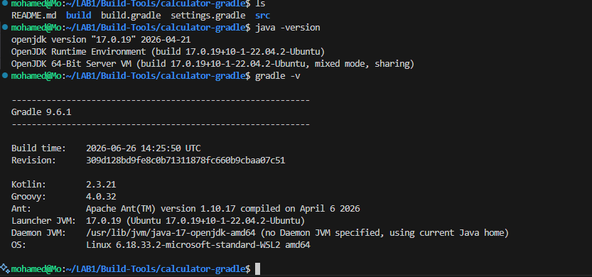
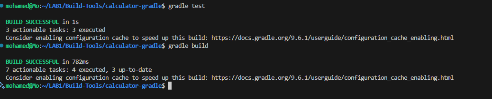
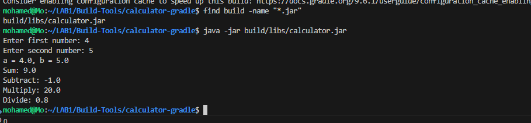

# Calculator Gradle - Lab 1

## Commands

```bash
gradle test
gradle build
java -jar build/libs/calculator.jar
```

## Java & Gradle Version



---

## Unit Test & Build Success



---

## Generated JAR & Application Running


