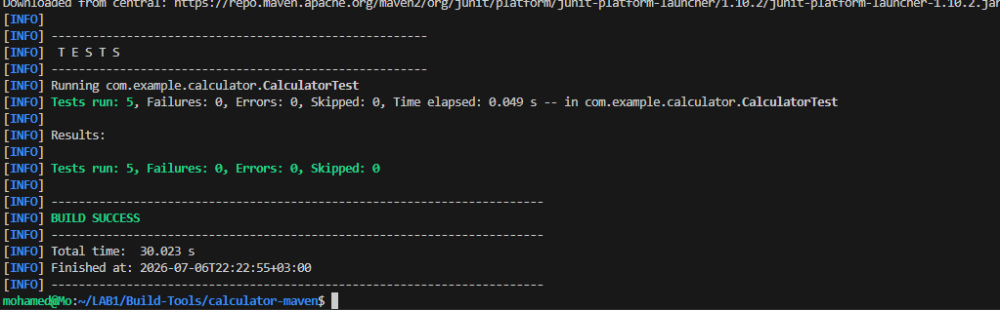
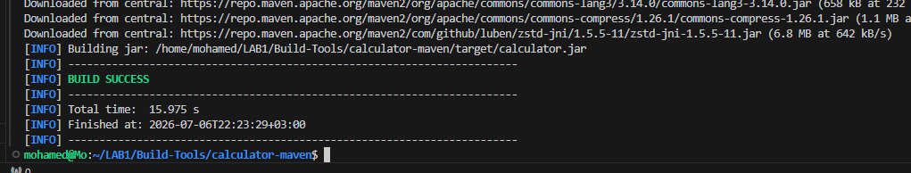
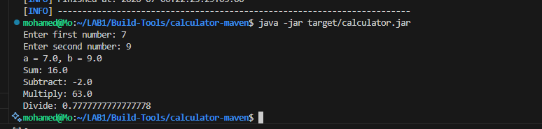

# Calculator Maven - Lab 2

## Overview

This lab demonstrates how to build and package a Java Calculator application using **Apache Maven**.

---

## Objectives

- Install Apache Maven
- Clone the Maven project
- Run Unit Tests
- Build the application
- Generate the executable JAR file
- Run the application successfully

---

## Project Structure

```
calculator-maven/
├── pom.xml
├── src/
├── screenshots/
│   ├── java-jar.png
│   ├── mvn-test.png
│   └── mvn-package.png
└── README.md
```

---

## Technologies

- Java 17
- Apache Maven
- JUnit

---

## Commands Used

### Check Maven Version

```bash
mvn -version
```

### Run Unit Tests

```bash
mvn test
```

### Build & Package

```bash
mvn clean package
```

### Run the Application

```bash
java -jar target/calculator.jar
```

---

# Screenshots

## Maven Unit Test



---

## Maven Build & Package



---

## Application Running



---

## Output

- ✅ Unit Tests Passed
- ✅ Build Successful
- ✅ JAR Generated Successfully
- ✅ Application Executed Successfully

---

## Author

**Mohamed Abdelhamed**

Cloud DevOps Accelerator Program
