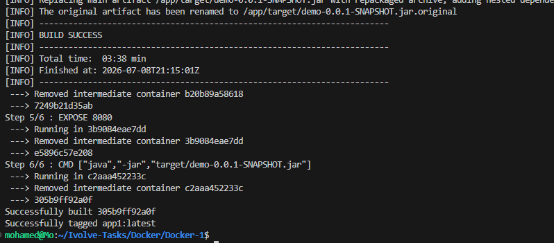
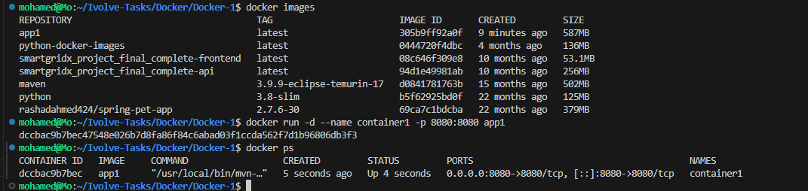
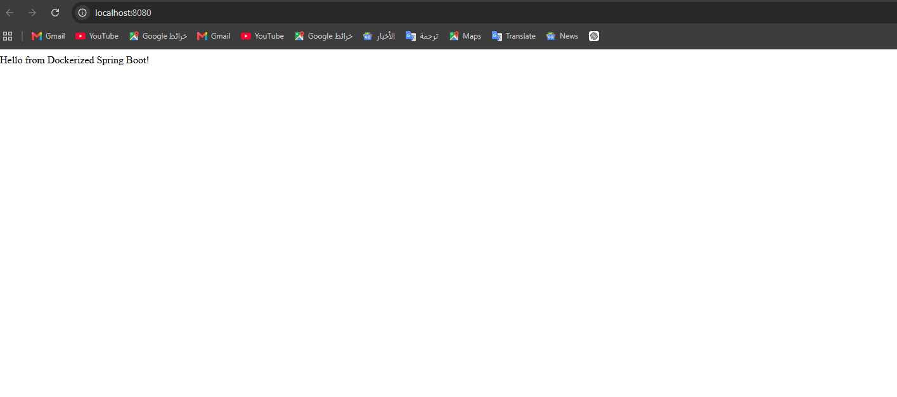
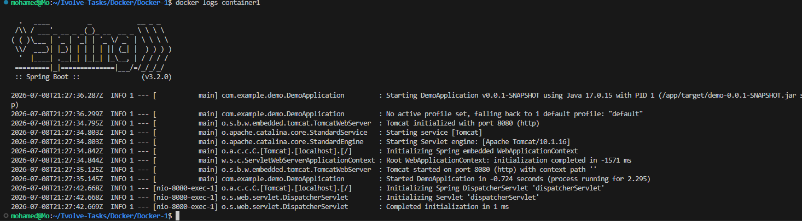
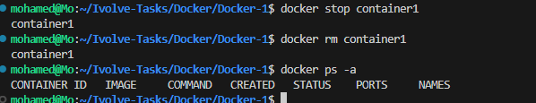

# Lab 3 - Run Java Spring Boot App in a Docker Container

## Objective

Containerize a Java Spring Boot application using Docker using a Maven image with Java 17.

## Technologies

- Java 17
- Spring Boot
- Maven
- Docker

## Dockerfile

```dockerfile
FROM maven:3.9.9-eclipse-temurin-17

WORKDIR /app

COPY . .

RUN mvn clean package

EXPOSE 8080

CMD ["java","-jar","target/demo-0.0.1-SNAPSHOT.jar"]
```

## Build the Image

```bash
docker build -t app1 .
```



## Run the Container

```bash
docker run -d --name container1 -p 8080:8080 app1
```



## Test the Application

```text
http://localhost:8080
```



## Docker Logs



## Stop and Remove

```bash
docker stop container1
docker rm container1
```



## Result

- ✅ Image built successfully
- ✅ Container started successfully
- ✅ Application is accessible on port 8080
- ✅ Container removed successfully