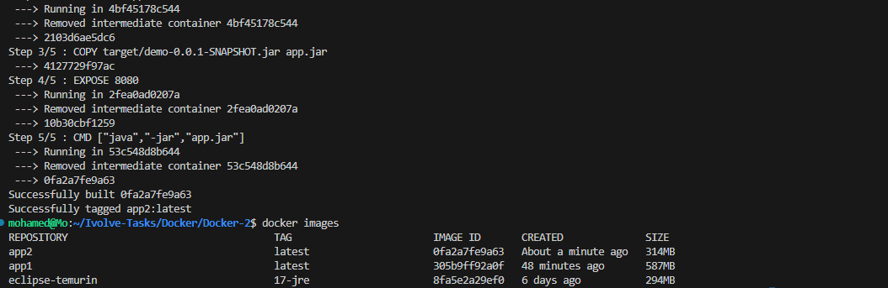
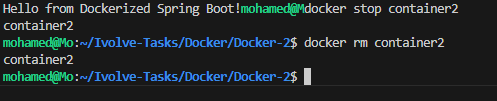

# Lab 4 - Run Java Spring Boot Application Using Java Runtime Image

## 📌 Objective

This lab demonstrates how to containerize a Spring Boot application using a lightweight Java 17 Runtime image instead of a Maven image.

---

## 🛠 Technologies

- Java 17
- Spring Boot
- Apache Maven
- Docker

---

## 📁 Project Structure

```text
Docker-2/
├── Dockerfile
├── pom.xml
├── src/
├── screenshots/
│   ├── 01-docker-build.png
│   ├── 02-application-running.png
│   └── 03-container-removed.png
└── README.md
```

---

## 🚀 Build the Application

```bash
mvn clean package
```

---

## 🐳 Dockerfile

```dockerfile
FROM eclipse-temurin:17-jre

WORKDIR /app

COPY target/demo-0.0.1-SNAPSHOT.jar app.jar

EXPOSE 8080

CMD ["java", "-jar", "app.jar"]
```

---

## 🔨 Build Docker Image

```bash
docker build -t app2 .
```



---

## ▶️ Run the Container

```bash
docker run -d --name container2 -p 8080:8080 app2
```

---

## 🌐 Test the Application

Open your browser:

```text
http://localhost:8080
```

or use:

```bash
curl http://localhost:8080
```


---

## 📝 Stop & Remove the Container

```bash
docker stop container2
docker rm container2
```



---

## ✅ Result

- Successfully built the Spring Boot application.
- Successfully created a Docker image using Java 17 Runtime.
- Successfully ran the container.
- Application was accessible on **port 8080**.
- Successfully stopped and removed the container.

---

## 👨‍💻 Author

**Mohamed Abdelhamed**

Cloud DevOps Accelerator – Docker Labs
