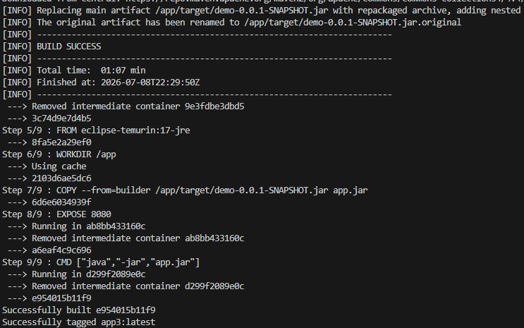
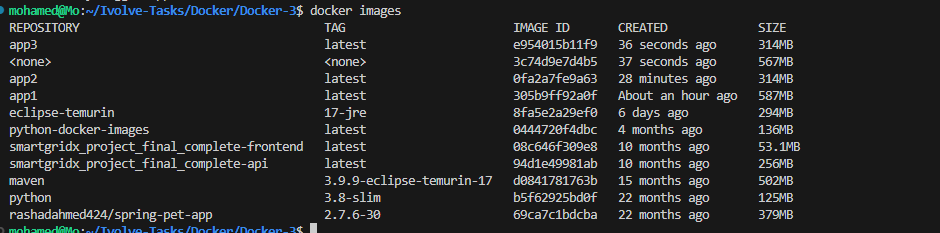
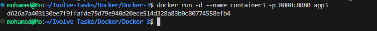
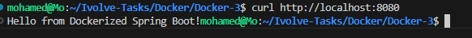
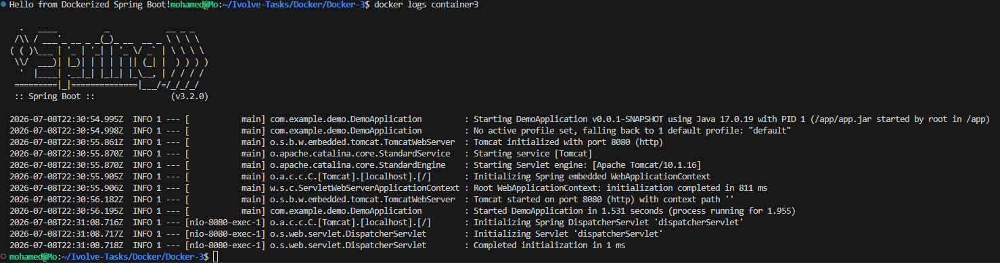
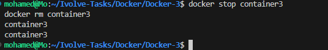
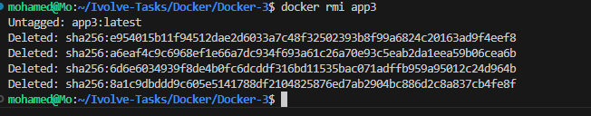

# Lab 5 - Multi-Stage Build for a Spring Boot Application

## 📌 Objective

This lab demonstrates how to build and run a Spring Boot application using a **Multi-Stage Docker Build** to reduce the final image size while keeping the build process inside Docker.

---

## 🛠 Technologies

- Java 17
- Spring Boot
- Apache Maven
- Docker

---

## 📁 Project Structure

```text
Docker-3/
├── Dockerfile
├── pom.xml
├── src/
├── screenshots/
│   ├── 01-docker-build.png
│   ├── 02-docker-images.png
│   ├── 03-container-running.png
│   ├── 04-application-running.png
│   ├── 05-docker-logs.png
│   ├── 06-container-removed.png
│   └── 07-image-deleted.png
└── README.md
```

---

# Multi-Stage Dockerfile

```dockerfile
# ---------- Stage 1 : Build ----------
FROM maven:3.9.9-eclipse-temurin-17 AS builder

WORKDIR /app

COPY . .

RUN mvn clean package -DskipTests

# ---------- Stage 2 : Runtime ----------
FROM eclipse-temurin:17-jre

WORKDIR /app

COPY --from=builder /app/target/demo-0.0.1-SNAPSHOT.jar app.jar

EXPOSE 8080

CMD ["java","-jar","app.jar"]
```

---

# Build Docker Image

```bash
docker build -t app3 .
```



---

# Docker Images

```bash
docker images
```



> **Note:**  
> The final image is significantly smaller than the image created in **Lab 3** because only the JAR file is copied to the runtime image.

---

# Run Container

```bash
docker run -d --name container3 -p 8080:8080 app3
```



---

# Test Application

Open your browser:

```text
http://localhost:8080
```

or

```bash
curl http://localhost:8080
```



---

# Docker Logs

```bash
docker logs container3
```



---

# Stop and Remove Container

```bash
docker stop container3
docker rm container3
```



---

# Delete Docker Image

```bash
docker rmi app3
```



---

# Result

- ✅ Multi-stage Docker build completed successfully.
- ✅ Spring Boot application packaged inside Docker.
- ✅ Final runtime image contains only Java Runtime and the application JAR.
- ✅ Container started successfully on **port 8080**.
- ✅ Application tested successfully.
- ✅ Container removed successfully.
- ✅ Docker image removed successfully.

---

# Comparison

| Lab | Build Method | Final Image |
|------|-------------|-------------|
| Lab 3 | Maven Image Only | Large (~587 MB) |
| Lab 4 | Java Runtime + Pre-built JAR | Smaller |
| Lab 5 | Multi-Stage Build | Smallest & Production Ready |

---

## 👨‍💻 Author

**Mohamed Abdelhamed**

Cloud DevOps Accelerator Program  
Docker Labs