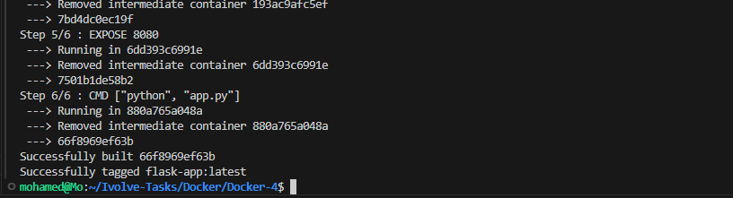
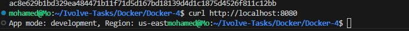
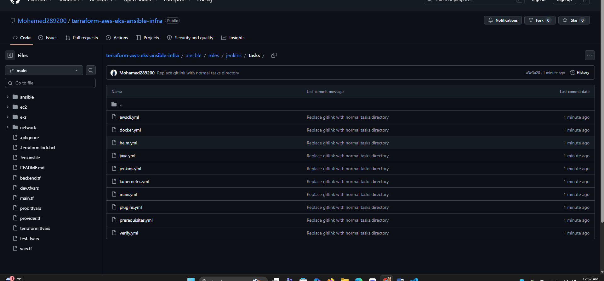
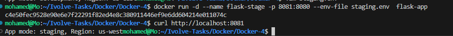
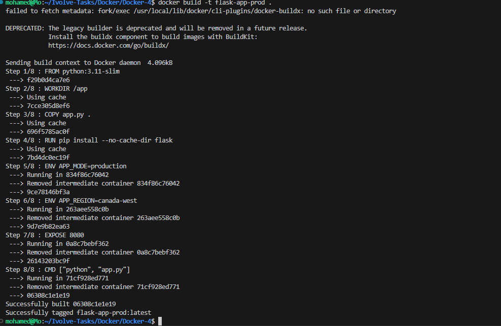
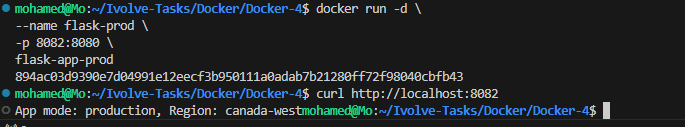
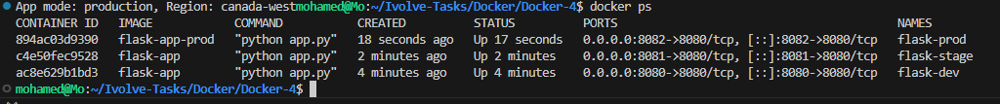
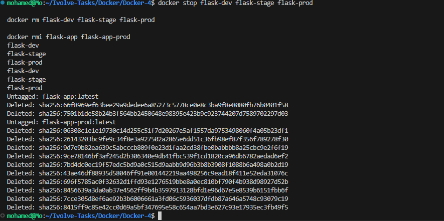

# Lab 6 - Managing Docker Environment Variables Across Build and Runtime

## 📌 Objective

This lab demonstrates different ways to configure environment variables for a Dockerized Flask application.

Three methods are covered:

- Passing variables using the `-e` option.
- Passing variables using an `--env-file`.
- Defining variables inside the Dockerfile using `ENV`.

---

# 🛠 Technologies

- Python 3.11
- Flask
- Docker

---

# 📁 Project Structure

```text
Docker-4/
├── Dockerfile
├── app.py
├── staging.env
├── screenshots/
│   ├── 01-docker-build.png
│   ├── 02-development-env.png
│   ├── 03-staging-env.png
│   ├── 04-production-env.png
│   ├── 05-docker-ps.png
│   ├── 06-docker-logs.png
│   ├── 07-cleanup.png
│   ├── 08-dockerfile.png
│   └── 09-env-file.png
└── README.md
```

---

# Dockerfile

```dockerfile
FROM python:3.11-slim

WORKDIR /app

COPY app.py .

RUN pip install --no-cache-dir flask

ENV APP_MODE=production
ENV APP_REGION=canada-west

EXPOSE 8080

CMD ["python", "app.py"]
```

---

# Build Docker Image

```bash
docker build -t flask-app .
```



---

# Method 1 — Runtime Environment Variables (-e)

Run the container by passing variables directly from the command line.

```bash
docker run -d \
--name flask-dev \
-p 8080:8080 \
-e APP_MODE=development \
-e APP_REGION=us-east \
flask-app
```

Output:

```
App mode: development, Region: us-east
```



---

# Method 2 — Environment File (--env-file)

Create a file named **staging.env**

```text
APP_MODE=staging
APP_REGION=us-west
```



Run:

```bash
docker run -d \
--name flask-stage \
-p 8081:8080 \
--env-file staging.env \
flask-app
```

Output:

```
App mode: staging, Region: us-west
```



---

# Method 3 — Dockerfile ENV

Environment variables are defined directly inside the Dockerfile.

```dockerfile
ENV APP_MODE=production
ENV APP_REGION=canada-west
```

Rebuild:

```bash
docker build -t flask-app-prod .
```

Run:

```bash
docker run -d \
--name flask-prod \
-p 8082:8080 \
flask-app-prod
```

Output:

```
App mode: production, Region: canada-west
```



---

# Running Containers

```bash
docker ps
```



---

# Docker Logs

```bash
docker logs flask-dev
```



---

# Cleanup

Stop and remove all containers and images.

```bash
docker stop flask-dev flask-stage flask-prod

docker rm flask-dev flask-stage flask-prod

docker rmi flask-app flask-app-prod
```



---

# Result

- ✅ Docker image built successfully.
- ✅ Flask application runs correctly.
- ✅ Environment variables successfully passed using `-e`.
- ✅ Environment variables successfully loaded using `--env-file`.
- ✅ Environment variables successfully defined using `ENV`.
- ✅ All containers tested successfully.
- ✅ Environment cleaned successfully.

---

# Key Learning

This lab demonstrates three different approaches for managing environment variables in Docker:

| Method | Use Case |
|---------|----------|
| `-e` | Quick runtime configuration |
| `--env-file` | Store multiple variables in a separate file |
| `ENV` | Define default values inside the Docker image |

---

## 👨‍💻 Author

**Mohamed Abdelhamed**

Cloud DevOps Accelerator Program
