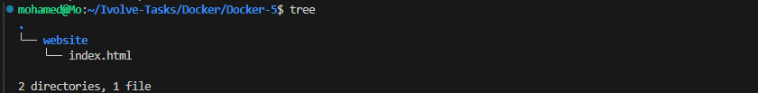
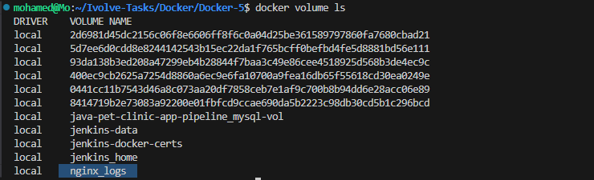
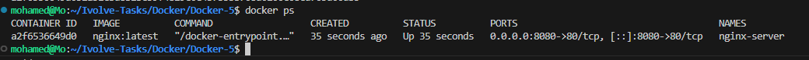
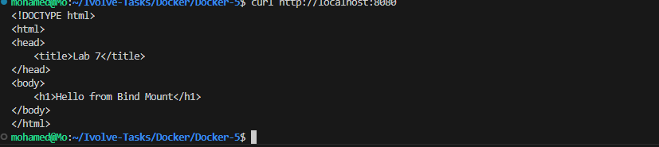
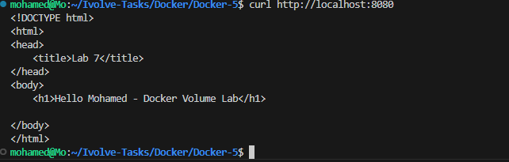
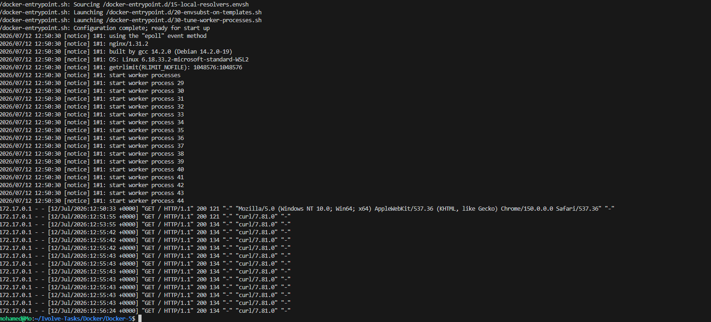
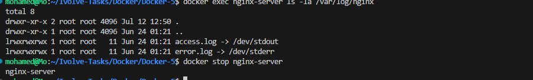
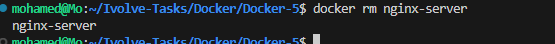
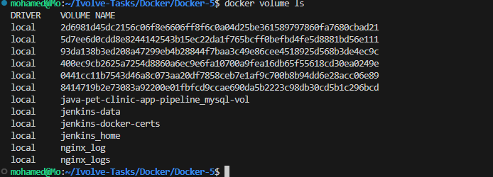
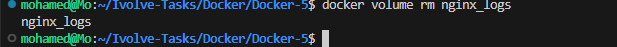

# Lab 7 - Docker Volume and Bind Mount with Nginx

## 📌 Objective

This lab demonstrates the difference between **Docker Volumes** and **Bind Mounts** using an Nginx container.

- Docker Volume is used to persist Nginx logs.
- Bind Mount is used to serve web content directly from the host machine.

---

# 🛠 Technologies

- Docker
- Nginx
- Docker Volume
- Bind Mount

---

# 📁 Project Structure

```text
Docker-5/
├── website/
│   └── index.html
├── screenshots/
│   ├── 01-website-files.png
│   ├── 02-volume-created.png
│   ├── 03-volume-inspect.png
│   ├── 04-nginx-running.png
│   ├── 05-website-opened.png
│   ├── 06-bind-mount-working.png
│   ├── 07-docker-logs.png
│   ├── 08-container-stopped.png
│   ├── 09-container-removed.png
│   ├── 10-volume-exists.png
│   └── 11-volume-removed.png
└── README.md
```

---

# Step 1 - Create Website Files

Create a directory named **website** and add an `index.html` file.

```html
<!DOCTYPE html>
<html>
<head>
    <title>Lab 7</title>
</head>
<body>
    <h1>Hello from Bind Mount</h1>
</body>
</html>
```



---

# Step 2 - Create Docker Volume

```bash
docker volume create nginx_logs
```

Verify:

```bash
docker volume ls
```



---

# Step 3 - Verify Volume Location

```bash
docker volume inspect nginx_logs
```

The volume is stored in Docker's default volume directory.


---

# Step 4 - Run Nginx Container

```bash
docker run -d \
--name nginx-server \
-p 8080:80 \
-v nginx_logs:/var/log/nginx \
-v $(pwd)/website:/usr/share/nginx/html \
nginx:latest
```

### Explanation

- `-p 8080:80` → Publish Nginx on localhost:8080.
- `nginx_logs:/var/log/nginx` → Store Nginx logs in a Docker Volume.
- `$(pwd)/website:/usr/share/nginx/html` → Mount website files from the host machine.



---

# Step 5 - Verify Website

```bash
curl http://localhost:8080
```

Output:

```
Hello from Bind Mount
```



---

# Step 6 - Verify Bind Mount

Modify **website/index.html** on the host machine.

```html
<h1>Hello Mohamed - Docker Volume Lab</h1>
```

Refresh the page.

No container restart is required.



---

# Step 7 - Verify Container Logs

```bash
docker logs nginx-server
```

The logs confirm that requests are being processed correctly.



---

# Step 8 - Stop the Container

```bash
docker stop nginx-server
```



---

# Step 9 - Remove the Container

```bash
docker rm nginx-server
```



---

# Step 10 - Verify Docker Volume Still Exists

```bash
docker volume ls
```

Even after deleting the container, the volume still exists because Docker Volumes are independent from containers.



---

# Step 11 - Remove Docker Volume

```bash
docker volume rm nginx_logs
```



---

# Docker Volume vs Bind Mount

| Docker Volume | Bind Mount |
|---------------|------------|
| Managed by Docker | Uses a directory from the host machine |
| Stores persistent data | Used during development |
| Independent of containers | Directly reflects host file changes |
| Ideal for databases and logs | Ideal for website source files |

---

# Result

- ✅ Created a Docker Volume.
- ✅ Verified Docker Volume location.
- ✅ Created a Bind Mount for website files.
- ✅ Successfully served a custom HTML page with Nginx.
- ✅ Verified live updates without restarting the container.
- ✅ Verified Docker logs.
- ✅ Verified that the Docker Volume persisted after container removal.
- ✅ Successfully removed the Docker Volume.

---

## 👨‍💻 Author

**Mohamed Abdelhamed**

Cloud DevOps Accelerator Program