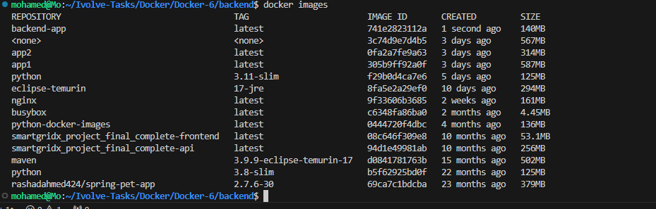
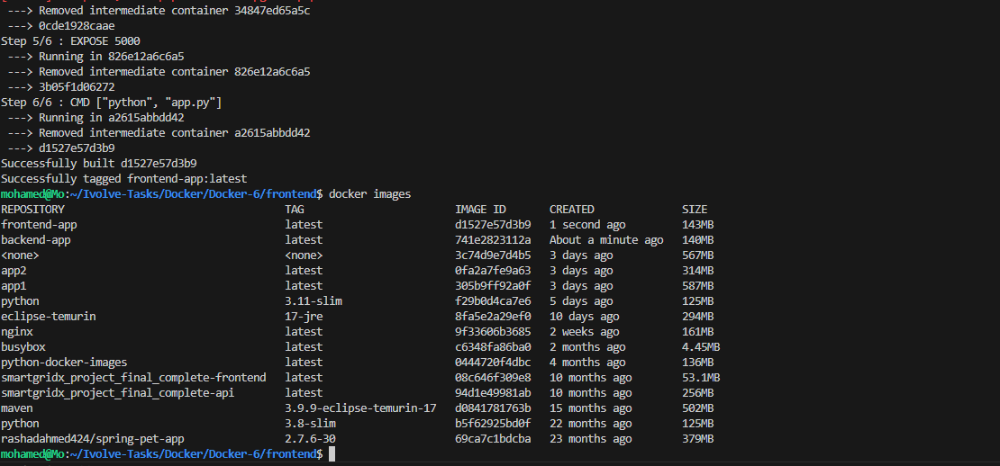
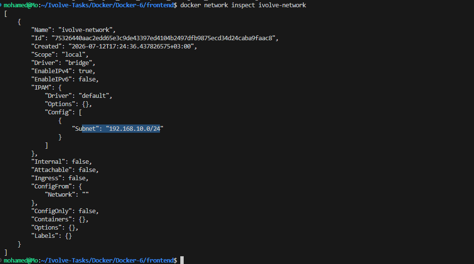
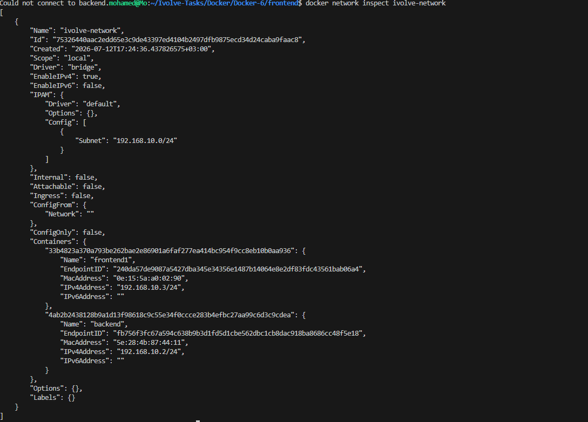
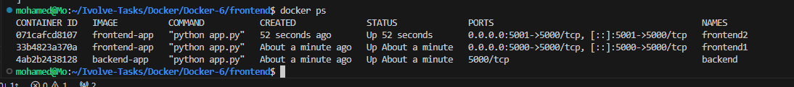
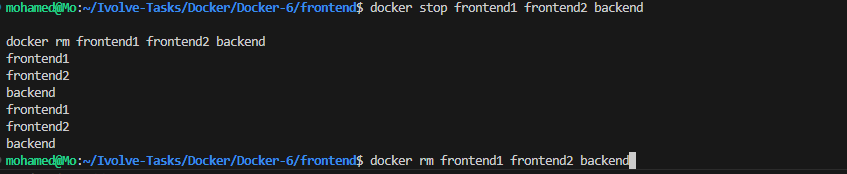
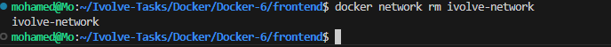

# Lab 8 - Custom Docker Network for Microservices

## 📌 Objective

This lab demonstrates how to connect multiple containers using a **custom Docker network**.

The lab includes:

- Building a Backend Docker image.
- Building a Frontend Docker image.
- Creating a custom Docker network.
- Running both containers inside the same network.
- Demonstrating successful communication between containers.
- Demonstrating failed communication when a container is outside the custom network.

---

# 🛠 Technologies

- Docker
- Docker Network
- Python
- Flask
- Requests

---

# 📁 Project Structure

```text
Docker-6/
├── backend/
│   ├── app.py
│   └── Dockerfile
│
├── frontend/
│   ├── app.py
│   ├── requirements.txt
│   └── Dockerfile
│
├── screenshots/
│   ├── 01-backend-build.png
│   ├── 02-frontend-build.png
│   ├── 03-network-created.png
│   ├── 04-backend-running.png
│   ├── 05-frontend1-success.png
│   ├── 06-frontend2-failed.png
│   ├── 07-network-inspect.png
│   ├── 08-docker-ps.png
│   ├── 09-containers-removed.png
│   └── 10-network-removed.png
│
└── README.md
```

---

# Backend Dockerfile

```dockerfile
FROM python:3.11-slim

WORKDIR /app

COPY app.py .

RUN pip install --no-cache-dir flask

EXPOSE 5000

CMD ["python", "app.py"]
```

---

# Frontend Dockerfile

```dockerfile
FROM python:3.11-slim

WORKDIR /app

COPY . .

RUN pip install --no-cache-dir -r requirements.txt

EXPOSE 5000

CMD ["python", "app.py"]
```

---

# Build Backend Image

```bash
cd backend

docker build -t backend-app .
```



---

# Build Frontend Image

```bash
cd frontend

docker build -t frontend-app .
```



---

# Create Custom Network

```bash
docker network create \
--subnet=192.168.10.0/24 \
ivolve-network
```

Verify:

```bash
docker network ls

docker network inspect ivolve-network
```



---

# Run Backend Container

```bash
docker run -d \
--name backend \
--network ivolve-network \
backend-app
```


---

# Run Frontend1 (Same Network)

```bash
docker run -d \
--name frontend1 \
--network ivolve-network \
-p 5000:5000 \
frontend-app
```

Test:

```bash
curl http://localhost:5000
```

Output:

```
Frontend received: Hello from Backend!
```

Because both containers are connected to the same Docker network, Docker's internal DNS resolves the hostname **backend** automatically.


---

# Run Frontend2 (Default Bridge Network)

```bash
docker run -d \
--name frontend2 \
-p 5001:5000 \
frontend-app
```

Test:

```bash
curl http://localhost:5001
```

Output:

```
Could not connect to backend.
```

Since **frontend2** is not attached to **ivolve-network**, it cannot resolve the hostname **backend**.


---

# Inspect Docker Network

```bash
docker network inspect ivolve-network
```

The custom network contains:

- backend
- frontend1

It does **not** contain:

- frontend2



---

# Running Containers

```bash
docker ps
```



---

# Remove Containers

```bash
docker stop frontend1 frontend2 backend

docker rm frontend1 frontend2 backend
```



---

# Remove Docker Network

```bash
docker network rm ivolve-network
```

Verify:

```bash
docker network ls
```



---

# Docker Networking Concept

```
                 +---------------------------+
                 |     ivolve-network        |
                 |                           |
                 |   backend <----------+    |
                 |        ▲             |    |
                 |        |             |    |
                 |   frontend1 ---------+    |
                 +---------------------------+

        frontend2
      (Default Bridge Network)

      ❌ Cannot reach backend
```

---

# Result

- ✅ Backend image created successfully.
- ✅ Frontend image created successfully.
- ✅ Custom Docker network created successfully.
- ✅ Backend and Frontend1 communicated successfully.
- ✅ Frontend2 failed to communicate because it was on a different network.
- ✅ Docker network inspected successfully.
- ✅ Containers removed successfully.
- ✅ Docker network removed successfully.

---

# Key Learning

- Docker automatically provides **DNS-based service discovery** inside the same custom network.
- Containers communicate using **container names** instead of IP addresses.
- Containers on different Docker networks cannot communicate unless explicitly connected.

---

## 👨‍💻 Author

**Mohamed Abdelhamed**

Cloud DevOps Accelerator Program