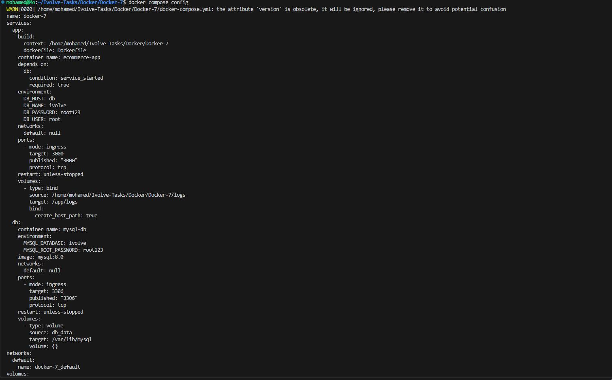
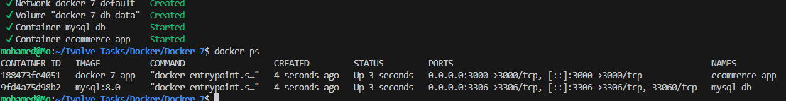
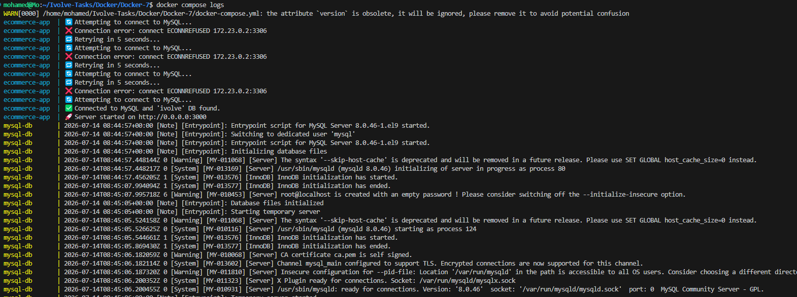
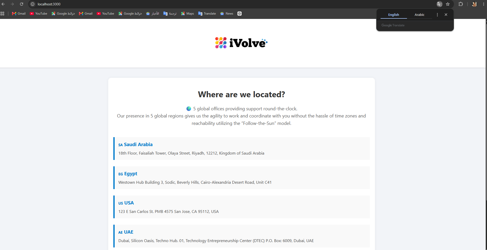
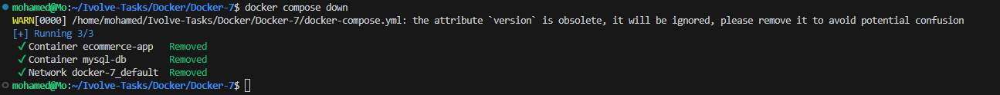

# Lab 9 - Multi-Container Application with Docker Compose

## 📌 Objective

This lab demonstrates how to deploy a multi-container application using **Docker Compose**.

The application consists of:

- **Node.js Backend**
- **MySQL Database**
- **Docker Volume** for persistent database storage
- **Docker Compose** to orchestrate all services

---

# 🛠 Technologies

- Docker
- Docker Compose
- Node.js
- Express.js
- MySQL 8
- Docker Volumes

---

# 📁 Project Structure

```text
Docker-7/
├── frontend/
├── Dockerfile
├── docker-compose.yml
├── server.js
├── db.js
├── package.json
├── screenshots/
│   ├── 01-compose-config.png
│   ├── 02-compose-up.png
│   ├── 03-containers-running.png
│   ├── 04-home-page.png
│   ├── 05-health-endpoint.png
│   ├── 06-ready-endpoint.png
│   ├── 07-application-logs.png
│   └── 08-compose-down.png
└── README.md
```

---

# Architecture

```
                Docker Compose

          +-------------------------+

          |      ecommerce-app      |
          |      Node.js            |
          |      Port 3000          |
          +-----------+-------------+
                      |
                      |
               DB_HOST=db
                      |
                      |
          +-----------v-------------+
          |       mysql-db          |
          |       MySQL 8           |
          | Database: ivolve        |
          +-----------+-------------+
                      |
               Docker Volume
                      |
                  db_data
```

---

# Dockerfile

```dockerfile
FROM node:18-alpine

WORKDIR /app

COPY package.json ./

RUN npm install

COPY . .

EXPOSE 3000

CMD ["node","server.js"]
```

---

# Docker Compose Configuration

```yaml
version: "3.8"

services:

  app:
    build: .

    container_name: ecommerce-app

    ports:
      - "3000:3000"

    environment:
      DB_HOST: db
      DB_USER: root
      DB_PASSWORD: root123
      DB_NAME: ivolve

    depends_on:
      - db

    volumes:
      - ./logs:/app/logs

  db:

    image: mysql:8

    container_name: mysql-db

    restart: always

    environment:
      MYSQL_ROOT_PASSWORD: root123
      MYSQL_DATABASE: ivolve

    volumes:
      - db_data:/var/lib/mysql

volumes:

  db_data:
```

---

# Validate Docker Compose

```bash
docker compose config
```



---

# Start Application

```bash
docker compose up --build -d
```

Docker Compose automatically:

- Builds the Node.js image
- Pulls MySQL image
- Creates the custom network
- Creates Docker Volume
- Starts all services



---

# Running Containers

```bash
docker ps
```

Both containers should be running.

- ecommerce-app
- mysql-db



---

# Verify Application

Open:

```
http://localhost:3000
```

or

```bash
curl localhost:3000
```

The application loads successfully and retrieves data from MySQL.



---

# Health Endpoint

```bash
curl localhost:3000/health
```

The endpoint confirms that the application is healthy.


---

# Readiness Endpoint

```bash
curl localhost:3000/ready
```

The endpoint verifies that the application is ready to serve requests.


---

# Application Logs

```bash
docker compose logs

# or

docker logs ecommerce-app
```

Logs confirm successful startup and database connectivity.


---

# Stop and Remove Services

```bash
docker compose down
```

Docker Compose stops:

- Node.js container
- MySQL container
- Network

The Docker Volume remains available unless removed manually.



---

# Docker Compose Features Demonstrated

- Multi-container deployment
- Service dependency using `depends_on`
- Environment Variables
- Docker Volumes
- Automatic Network Creation
- Container Communication by Service Name
- Persistent Database Storage

---

# Result

- ✅ Docker image built successfully.
- ✅ MySQL container deployed successfully.
- ✅ Node.js application connected to MySQL.
- ✅ Docker Compose managed both services.
- ✅ Application health endpoint verified.
- ✅ Application readiness endpoint verified.
- ✅ Persistent storage configured using Docker Volumes.
- ✅ Entire application managed using a single `docker-compose.yml` file.

---

# Key Learning

This lab demonstrates how Docker Compose simplifies multi-container applications by managing:

- Service orchestration
- Networking
- Volumes
- Environment variables
- Dependencies

with a single configuration file.

---

## 👨‍💻 Author

**Mohamed Ahmed Abdelhamid**

Computer Engineering Student

Cloud & DevOps Trainee