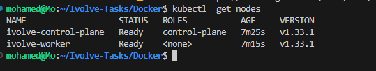
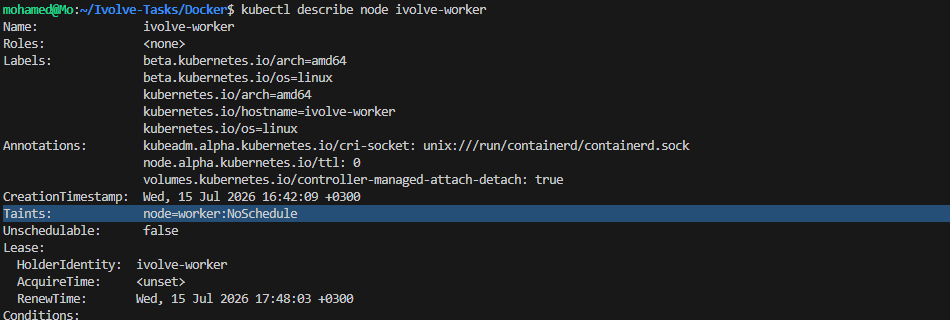

# Lab 10 - Kubernetes Node Isolation Using Taints

## 📌 Objective

This lab demonstrates how to isolate Kubernetes nodes using **Taints**.

A taint prevents Pods from being scheduled onto a node unless they explicitly tolerate that taint.

In this lab, a custom Kubernetes cluster was created using **Kind**, then a worker node was tainted with the **NoSchedule** effect and later restored by removing the taint.

---

# 🛠 Technologies

- Kubernetes
- kubectl
- Kind (Kubernetes in Docker)
- Docker

---

# 📁 Project Structure

```text
Kubernetes-1/
├── kind-config.yaml
├── screenshots/
│   ├── 01-cluster-nodes.png
│   ├── 02-worker-tainted.png
│   ├── 03-describe-worker.png
│   ├── 04-taints-verification.png
│   ├── 05-taint-removed.png
│   └── 06-no-taints.png
└── README.md
```

---

# Architecture

```
                Kind Cluster

        +-----------------------------+
        |     Control Plane Node      |
        |                             |
        |  Schedules Pods             |
        +-------------+---------------+
                      |
                      |
          Scheduler checks Taints
                      |
        +-------------v---------------+
        |         Worker Node         |
        |                             |
        | node=worker:NoSchedule      |
        +-----------------------------+

Pods without a matching Toleration
          ❌ Cannot be scheduled
```

---

# Step 1 - Create a Kind Cluster

Create a cluster with one control-plane node and one worker node.

**kind-config.yaml**

```yaml
kind: Cluster
apiVersion: kind.x-k8s.io/v1alpha4

nodes:
- role: control-plane
- role: worker
```

Create the cluster:

```bash
kind create cluster --name ivolve --config kind-config.yaml
```

Verify the nodes:

```bash
kubectl get nodes
```



---

# Step 2 - Apply a Taint

Apply a taint to the worker node.

```bash
kubectl taint nodes ivolve-worker node=worker:NoSchedule
```

Expected output:

```
node/ivolve-worker tainted
```


---

# Step 3 - Verify the Taint

Describe the worker node.

```bash
kubectl describe node ivolve-worker
```

Or display only the taints:

```bash
kubectl describe node ivolve-worker | grep Taints
```

Expected output:

```
Taints:
node=worker:NoSchedule
```



---

# Step 4 - Verify Taints

```bash
kubectl describe node ivolve-worker | grep Taints
```

The worker node is now protected from scheduling regular Pods.


---

# Step 5 - Remove the Taint

```bash
kubectl taint nodes ivolve-worker node=worker:NoSchedule-
```

Expected output:

```
node/ivolve-worker untainted
```


---

# Step 6 - Verify Removal

```bash
kubectl describe node ivolve-worker | grep Taints
```

Expected output:

```
Taints: <none>
```


---

# Understanding Taints

A **Taint** is applied to a Kubernetes node to restrict Pod scheduling.

Syntax:

```bash
kubectl taint nodes <node-name> key=value:effect
```

Example:

```bash
kubectl taint nodes ivolve-worker node=worker:NoSchedule
```

---

# Taint Effects

| Effect | Description |
|---------|-------------|
| NoSchedule | Prevents new Pods from being scheduled unless they tolerate the taint. |
| PreferNoSchedule | Scheduler tries to avoid placing Pods on the node. |
| NoExecute | Removes existing Pods that do not tolerate the taint and blocks new ones. |

---

# Taints vs Tolerations

| Taints | Tolerations |
|--------|-------------|
| Applied to Nodes | Applied to Pods |
| Repel Pods | Allow Pods onto tainted Nodes |
| Control scheduling | Override matching taints |

---

# Key Commands

Create Cluster

```bash
kind create cluster --name ivolve --config kind-config.yaml
```

List Nodes

```bash
kubectl get nodes
```

Apply Taint

```bash
kubectl taint nodes ivolve-worker node=worker:NoSchedule
```

Describe Node

```bash
kubectl describe node ivolve-worker
```

Show Taints

```bash
kubectl describe node ivolve-worker | grep Taints
```

Remove Taint

```bash
kubectl taint nodes ivolve-worker node=worker:NoSchedule-
```

---

# Result

- ✅ Created a Kubernetes cluster using Kind.
- ✅ Verified cluster nodes.
- ✅ Applied a NoSchedule taint to the worker node.
- ✅ Verified the taint using `kubectl describe`.
- ✅ Removed the taint successfully.
- ✅ Verified that no taints remained on the worker node.

---

# Key Learning

This lab demonstrates how Kubernetes controls Pod scheduling using **Node Taints**.

Taints are commonly used to:

- Reserve nodes for specific workloads.
- Protect infrastructure nodes.
- Isolate GPU or high-memory nodes.
- Control scheduling behavior in production clusters.

---

## 👨‍💻 Author

**Mohamed Ahmed Abdelhamid**

Computer Engineering Student

Cloud & DevOps Trainee