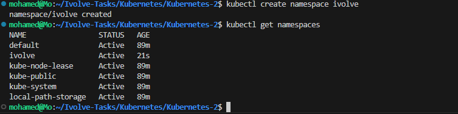
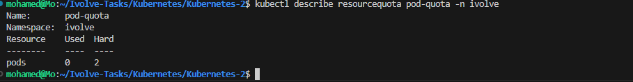

# Lab 11 - Namespace Management and Resource Quota Enforcement

## 📌 Objective

This lab demonstrates how to isolate Kubernetes workloads using **Namespaces** and control resource consumption using **ResourceQuota**.

A dedicated namespace named **ivolve** was created, and a ResourceQuota was applied to limit the namespace to a maximum of **2 Pods**.

---

# 🛠 Technologies

- Kubernetes
- kubectl
- Kind (Kubernetes in Docker)
- Docker

---

# 📁 Project Structure

```text
Kubernetes-2/
├── resource-quota.yaml
├── README.md
└── screenshots/
    ├── 01-namespace-created.png
    ├── 02-resourcequota-created.png
    ├── 03-resourcequota-list.png
    ├── 04-resourcequota-describe.png
    ├── 05-two-pods-running.png
    ├── 06-quota-exceeded.png
    └── 07-resourcequota-usage.png
```

---

# Architecture

```
                    Kubernetes Cluster

      +----------------------------------------+
      |             Namespace: ivolve          |
      |                                        |
      |   +-----------+    +-----------+       |
      |   | nginx-1   |    | nginx-2   |       |
      |   +-----------+    +-----------+       |
      |                                        |
      |   ResourceQuota                        |
      |   pods = 2                             |
      +-------------------+--------------------+
                          |
                          |
                nginx-3 ❌ Rejected
          (Quota limit exceeded)
```

---

# Step 1 - Create Namespace

Create a dedicated namespace.

```bash
kubectl create namespace ivolve
```

Verify:

```bash
kubectl get namespaces
```



---

# Step 2 - Create ResourceQuota

Create **resource-quota.yaml**

```yaml
apiVersion: v1
kind: ResourceQuota

metadata:
  name: pod-quota
  namespace: ivolve

spec:
  hard:
    pods: "2"
```

Apply it:

```bash
kubectl apply -f resource-quota.yaml
```


---

# Step 3 - Verify ResourceQuota

```bash
kubectl get resourcequota -n ivolve
```


---

# Step 4 - Describe ResourceQuota

```bash
kubectl describe resourcequota pod-quota -n ivolve
```

The output shows:

- Hard Limit
- Current Usage



---

# Step 5 - Deploy Pods

Create two Pods inside the namespace.

```bash
kubectl run nginx-1 --image=nginx -n ivolve

kubectl run nginx-2 --image=nginx -n ivolve
```

Verify:

```bash
kubectl get pods -n ivolve
```

Both Pods are created successfully.


---

# Step 6 - Test the Quota

Try creating a third Pod.

```bash
kubectl run nginx-3 --image=nginx -n ivolve
```

Expected result:

```
Error from server (Forbidden)

exceeded quota:
pod-quota
```

The request is rejected because the namespace already reached its maximum number of Pods.


---

# Step 7 - Verify Quota Usage

```bash
kubectl get resourcequota -n ivolve
```

Current usage:

```
Used: 2
Hard: 2
```


---

# ResourceQuota Manifest

```yaml
apiVersion: v1
kind: ResourceQuota

metadata:
  name: pod-quota
  namespace: ivolve

spec:
  hard:
    pods: "2"
```

---

# What is a Namespace?

A **Namespace** is a logical partition inside a Kubernetes cluster.

Namespaces are commonly used to:

- Separate environments (Dev / Test / Production)
- Isolate teams
- Apply resource limits
- Manage RBAC permissions

---

# What is ResourceQuota?

A **ResourceQuota** limits resource consumption inside a namespace.

It can restrict:

- Pods
- CPU
- Memory
- Persistent Volume Claims
- Services
- ConfigMaps
- Secrets

---

# Key Commands

Create Namespace

```bash
kubectl create namespace ivolve
```

Apply ResourceQuota

```bash
kubectl apply -f resource-quota.yaml
```

List ResourceQuotas

```bash
kubectl get resourcequota -n ivolve
```

Describe ResourceQuota

```bash
kubectl describe resourcequota pod-quota -n ivolve
```

Create Pods

```bash
kubectl run nginx-1 --image=nginx -n ivolve

kubectl run nginx-2 --image=nginx -n ivolve
```

---

# Result

- ✅ Created a dedicated namespace.
- ✅ Applied a ResourceQuota successfully.
- ✅ Limited the namespace to **2 Pods**.
- ✅ Verified the quota configuration.
- ✅ Confirmed that Kubernetes rejected the third Pod.
- ✅ Verified current quota usage.

---

# Key Learning

This lab demonstrates how Kubernetes administrators can:

- Isolate workloads using Namespaces.
- Prevent resource exhaustion using ResourceQuota.
- Enforce resource governance across different teams and applications.

---

## 👨‍💻 Author

**Mohamed Ahmed Abdelhamid**

Computer Engineering Student

Cloud & DevOps Trainee