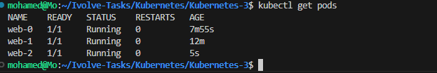
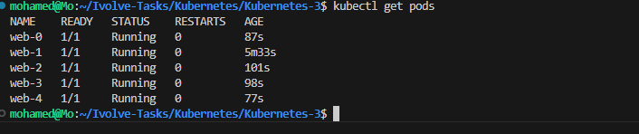
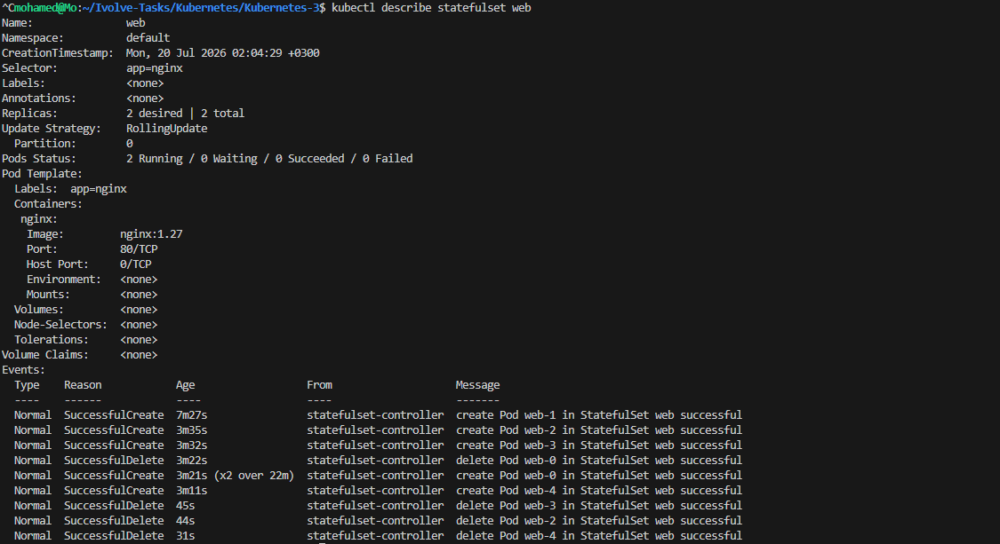

# Lab 12 - StatefulSet in Kubernetes

## 📌 Objective

This lab demonstrates how to deploy and manage **Stateful Applications** in Kubernetes using **StatefulSet**.

Unlike Deployments, StatefulSets provide:

- Stable Pod Names
- Stable Network Identity
- Ordered Pod Creation
- Ordered Pod Deletion
- Persistent Storage Support

---

# 🛠 Technologies

- Kubernetes
- Kind
- kubectl
- Docker
- Nginx

---

# 📁 Project Structure

```text
Kubernetes-3/
├── headless-service.yaml
├── statefulset.yaml
├── README.md
└── screenshots/
    ├── 01-headless-service.png
    ├── 02-statefulset-created.png
    ├── 03-statefulset-list.png
    ├── 04-pods-created.png
    ├── 05-scale-up.png
    ├── 06-scale-down.png
    └── 07-statefulset-describe.png
```

---

# 🏗 Architecture

```
                     Kubernetes Cluster

                  +----------------------+
                  | Headless Service     |
                  |      nginx           |
                  +----------+-----------+
                             |
        ---------------------------------------------
        |                   |                   |
     web-0              web-1              web-2
        |                   |                   |
     Stable ID          Stable ID          Stable ID
```

---

# Step 1 - Create Headless Service

A Headless Service provides stable network identities for StatefulSet Pods.

Create the service:

```bash
kubectl apply -f headless-service.yaml
```

Verify:

```bash
kubectl get svc
```


---

# Step 2 - Create StatefulSet

Deploy a StatefulSet with three replicas.

```bash
kubectl apply -f statefulset.yaml
```


---

# Step 3 - Verify StatefulSet

Check the StatefulSet status.

```bash
kubectl get statefulset
```


---

# Step 4 - Verify Pods

Display the running Pods.

```bash
kubectl get pods
```

Pods are created with stable names:

- web-0
- web-1
- web-2



---

# Step 5 - Scale Up

Increase replicas from **3** to **5**.

```bash
kubectl scale statefulset web --replicas=5
```

Verify:

```bash
kubectl get pods
```

New Pods are created sequentially:

- web-3
- web-4



---

# Step 6 - Scale Down

Reduce replicas back to **2**.

```bash
kubectl scale statefulset web --replicas=2
```

Pods are removed in reverse order:

- web-4
- web-3
- web-2


---

# Step 7 - Describe StatefulSet

Display detailed information.

```bash
kubectl describe statefulset web
```



---

# Headless Service

A Headless Service is a Kubernetes Service with:

```yaml
clusterIP: None
```

It allows each StatefulSet Pod to receive its own DNS name instead of sharing a single ClusterIP.

Example:

```
web-0.nginx.default.svc.cluster.local
web-1.nginx.default.svc.cluster.local
web-2.nginx.default.svc.cluster.local
```

---

# StatefulSet vs Deployment

| Feature | Deployment | StatefulSet |
|----------|------------|-------------|
| Pod Identity | Random | Stable |
| DNS Name | Dynamic | Stable |
| Ordered Deployment | ❌ | ✅ |
| Ordered Deletion | ❌ | ✅ |
| Persistent Storage | Optional | Native Support |
| Best For | Stateless Apps | Databases & Stateful Apps |

---

# Key Commands

Create Service

```bash
kubectl apply -f headless-service.yaml
```

Create StatefulSet

```bash
kubectl apply -f statefulset.yaml
```

List StatefulSets

```bash
kubectl get statefulset
```

List Pods

```bash
kubectl get pods
```

Scale Up

```bash
kubectl scale statefulset web --replicas=5
```

Scale Down

```bash
kubectl scale statefulset web --replicas=2
```

Describe StatefulSet

```bash
kubectl describe statefulset web
```

---

# What I Learned

- Deploy Stateful Applications using StatefulSet.
- Create a Headless Service.
- Understand stable Pod identities.
- Scale StatefulSets up and down.
- Observe ordered Pod creation.
- Observe ordered Pod termination.
- Manage Stateful workloads in Kubernetes.

---

# Result

- ✅ Created a Headless Service.
- ✅ Deployed a StatefulSet.
- ✅ Verified stable Pod names.
- ✅ Scaled the StatefulSet to five replicas.
- ✅ Scaled it back to two replicas.
- ✅ Verified StatefulSet details.

---

## 👨‍💻 Author

**Mohamed Ahmed Abdelhamid**

Computer Engineering Student

Cloud & DevOps Trainee

GitHub: https://github.com/Mohamed289200