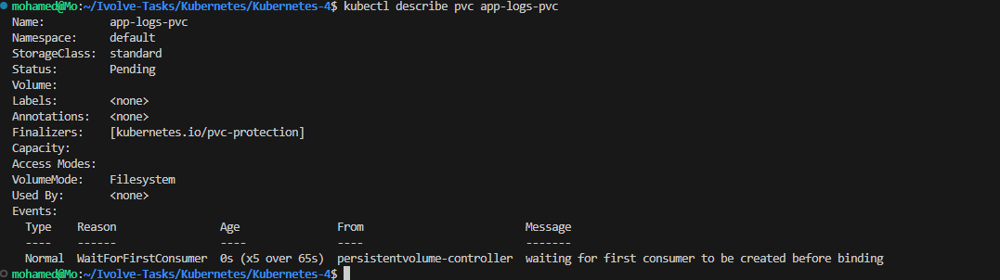
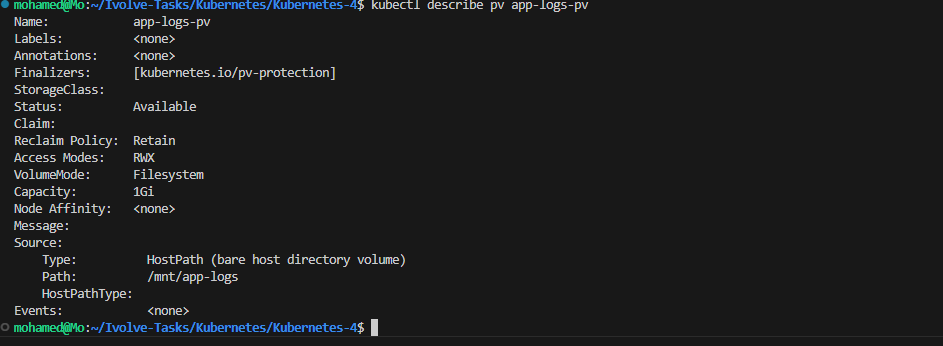

# Lab 13 - Persistent Storage Setup for Application Logging

## 📌 Objective

This lab demonstrates how Kubernetes provides persistent storage using **Persistent Volumes (PV)** and **Persistent Volume Claims (PVC)**.

A static Persistent Volume was created using **hostPath**, and a Persistent Volume Claim was created to request storage from that volume.

This allows applications to store data persistently even if Pods are deleted or recreated.

---

# 🛠 Technologies

- Kubernetes
- kubectl
- Kind (Kubernetes in Docker)
- Docker
- Persistent Volumes (PV)
- Persistent Volume Claims (PVC)

---

# 📁 Project Structure

```text
Kubernetes-4/
├── pv.yaml
├── pvc.yaml
├── README.md
└── screenshots/
    ├── 01-hostpath-created.png
    ├── 02-pv-created.png
    ├── 03-pv-list.png
    ├── 04-pvc-created.png
    ├── 05-pvc-list.png
    ├── 06-pv-describe.png
    └── 07-pvc-describe.png
```

---

# Architecture

```
                Kubernetes Cluster

        +------------------------------+
        |      Persistent Volume       |
        |------------------------------|
        | Name: app-logs-pv            |
        | Size: 1Gi                    |
        | Type: hostPath               |
        | Path: /mnt/app-logs          |
        | Reclaim: Retain              |
        +--------------+---------------+
                       |
                       | Bound
                       |
        +--------------v---------------+
        | Persistent Volume Claim      |
        |------------------------------|
        | Name: app-logs-pvc           |
        | Request: 1Gi                 |
        | Access: ReadWriteMany        |
        +--------------+---------------+
                       |
                       |
                 Future Applications
```

---

# Step 1 - Create hostPath Directory

Since Kind runs Kubernetes nodes as Docker containers, create the storage directory inside the worker node.

```bash
docker exec -it ivolve-worker mkdir -p /mnt/app-logs
```

Verify:

```bash
docker exec -it ivolve-worker ls -ld /mnt/app-logs
```



---

# Step 2 - Create Persistent Volume

Create **pv.yaml**

```yaml
apiVersion: v1
kind: PersistentVolume

metadata:
  name: app-logs-pv

spec:
  capacity:
    storage: 1Gi

  accessModes:
    - ReadWriteMany

  persistentVolumeReclaimPolicy: Retain

  hostPath:
    path: /mnt/app-logs
```

Apply it:

```bash
kubectl apply -f pv.yaml
```


---

# Step 3 - Verify Persistent Volume

```bash
kubectl get pv
```

The output should show the created Persistent Volume.


---

# Step 4 - Create Persistent Volume Claim

Create **pvc.yaml**

```yaml
apiVersion: v1
kind: PersistentVolumeClaim

metadata:
  name: app-logs-pvc

spec:
  accessModes:
    - ReadWriteMany

  resources:
    requests:
      storage: 1Gi
```

Apply it:

```bash
kubectl apply -f pvc.yaml
```


---

# Step 5 - Verify Persistent Volume Claim

```bash
kubectl get pvc
```

The PVC should be successfully created.


---

# Step 6 - Describe Persistent Volume

```bash
kubectl describe pv app-logs-pv
```

This command displays detailed information about the Persistent Volume.


---

# Step 7 - Describe Persistent Volume Claim

```bash
kubectl describe pvc app-logs-pvc
```

This command displays detailed information about the Persistent Volume Claim.



---

# Persistent Volume Manifest

```yaml
apiVersion: v1
kind: PersistentVolume

metadata:
  name: app-logs-pv

spec:
  capacity:
    storage: 1Gi

  accessModes:
    - ReadWriteMany

  persistentVolumeReclaimPolicy: Retain

  hostPath:
    path: /mnt/app-logs
```

---

# Persistent Volume Claim Manifest

```yaml
apiVersion: v1
kind: PersistentVolumeClaim

metadata:
  name: app-logs-pvc

spec:
  accessModes:
    - ReadWriteMany

  resources:
    requests:
      storage: 1Gi
```

---

# What is a Persistent Volume (PV)?

A **Persistent Volume (PV)** is a storage resource in a Kubernetes cluster.

It exists independently of Pods and can be reused by multiple applications.

---

# What is a Persistent Volume Claim (PVC)?

A **Persistent Volume Claim (PVC)** is a request for storage made by a Pod.

Instead of directly using storage, Pods request storage through a PVC.

---

# Why Use Persistent Storage?

Persistent storage allows applications to:

- Store logs
- Store databases
- Preserve uploaded files
- Keep data after Pod recreation
- Separate storage management from application deployment

---

# Key Commands

Create storage directory

```bash
docker exec -it ivolve-worker mkdir -p /mnt/app-logs
```

Apply PV

```bash
kubectl apply -f pv.yaml
```

Apply PVC

```bash
kubectl apply -f pvc.yaml
```

List Persistent Volumes

```bash
kubectl get pv
```

List Persistent Volume Claims

```bash
kubectl get pvc
```

Describe Persistent Volume

```bash
kubectl describe pv app-logs-pv
```

Describe Persistent Volume Claim

```bash
kubectl describe pvc app-logs-pvc
```

---

# Result

- ✅ Created a Persistent Volume.
- ✅ Created a Persistent Volume Claim.
- ✅ Successfully requested 1Gi of storage.
- ✅ Verified the PV configuration.
- ✅ Verified the PVC configuration.
- ✅ Prepared persistent storage for future Kubernetes applications.

---

# Key Learning

This lab demonstrates how Kubernetes manages persistent storage using Persistent Volumes and Persistent Volume Claims.

By separating storage from Pods, applications can retain data even after Pods are deleted or recreated, improving reliability and data persistence.

---

## 👨‍💻 Author

**Mohamed Ahmed Abdelhamid**

Computer Engineering Student

Cloud & DevOps Trainee